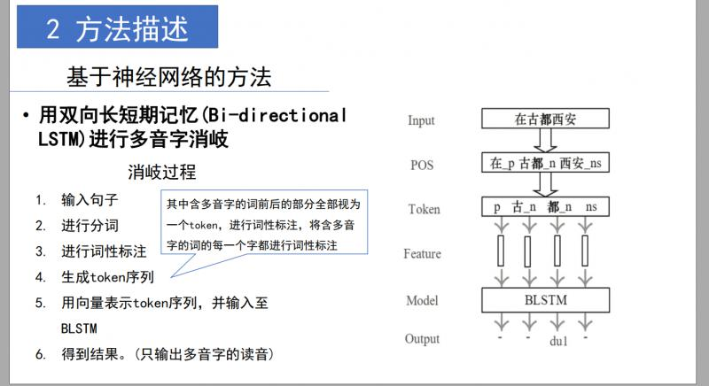

## 中文多音字消歧——利用POS标记，论文复现

***

### Baseline地址：
	https://github.com/hjzin/PolyphoneDisambiguation.git

### 原论文：
	A BLSTM Approach for Polyphone Disambiguation in Mandarin Chinese

***

### 模型流程

***

### 文件说明：
#### *data*：语料数据集。
注：数据集保密，只给出样例
1. metadata_txt_pinyin.csv：带有句子全部注音的，并且进行了儿化音连读和变调处理
2. offconti.csv：取消儿化音连读的数据，使得每一个汉字都有一个发音
3. addcorpus.txt：增加的语料库，只标记了句子中多音字的发音
4. addcorpus.csv：格式化之后的数据
5. polychar.txt：自定义的多音字库

#### *myprocess*：数据处理脚本
1. commonfun.py：常用的自定义函数集，具体说明请看脚本内注释
2. dictionary.py：加载多音字字典的类
3. offconti.py：用于处理metadata_txt_pinyin.csv，取消儿化音连读的脚本，并且导出成新的文件offcontidata.csv
4. add.py：用于处理addcorpus.txt，处理成与offcontidata.csv一样格式的脚本，并且导出成新的文件addcorpus.csv
5. pos.py：加载offcontidata.csv和addcorpus.csv，制作pos标记的三元组，生成训练验证测试文件

#### *DataProcessing*
1. configure.py：配置文件
2. num_of_polyphone.py：统计多音字
3. preprocessing.py：制作mini batch

#### *main*：
1. disambiguation.py：BLSTM训练主程序
2. pre.py：单条数据的前向预测脚本，可以单独直接运行
3. param.pkl：模型文件

***

### 训练自己的模型运行顺序：
step 1. 添加对应格式的语料到metadata_txt_pinyin.csv或者addcorpus.txt中
step 2. 运行add.py和offconti.py
step 3. 运行disambiguation.py

***

### 用已经训练好的模型跑单条数据的预测结果
main文件夹下的param.pkl是我已经训练好的模型，想要直接测试模型，请打开pre.py脚本，修改一下想要测试的多音字，直接运行pre.py即可，注意，格式必须是 **pos + 多音字_pos + pos**

***

### 注意
如果有任何错误，请修改DataProcessing下的配置文件

